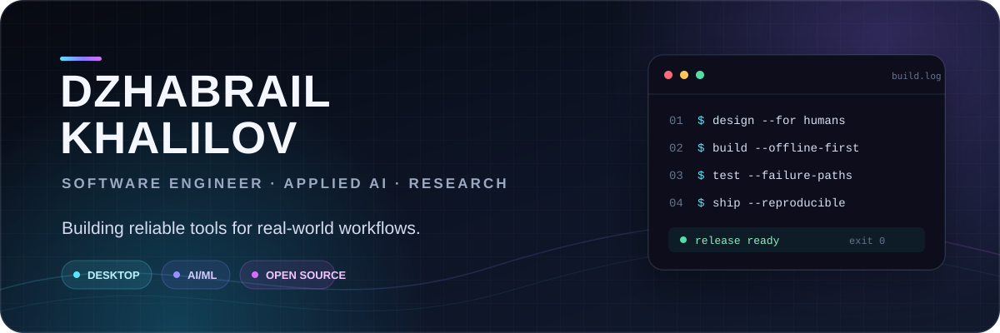

<p align="center">
  
</p>

<p align="center">
  <a href="https://xynapse.online">Products</a>
  &nbsp;·&nbsp;
  <a href="https://github.com/jabrailkhalil/clickntranslate/releases/latest">Download Click'n'Translate</a>
  &nbsp;·&nbsp;
  <a href="https://habr.com/ru/users/jabrailkhalilov/publications/articles/">Writing</a>
  &nbsp;·&nbsp;
  <a href="https://orcid.org/0009-0002-2391-692X">ORCID</a>
  &nbsp;·&nbsp;
  <a href="https://t.me/jabrail_digital">Telegram</a>
</p>

### I build software that stays useful outside the demo

I'm a software engineer working across **desktop products, applied AI, and reproducible research**. I care about fast everyday workflows, offline-first design, failure containment, and releases that people can actually install.

- Shipping [**Click'n'Translate**](https://github.com/jabrailkhalil/clickntranslate), an open-source screen OCR and translation app with online and fully offline engines.
- Building [**Xynapse IDE**](https://github.com/jabrailkhalil/xynapse), an AI-assisted development environment focused on practical coding workflows.
- Turning engineering work into auditable experiments, artifacts, and technical writing.
- Contributing production features and localization to established open-source projects.

### Selected work

| Project | What it does | Focus |
| :--- | :--- | :--- |
| [**Click'n'Translate**](https://github.com/jabrailkhalil/clickntranslate) | Captures, recognizes, and translates text from games, images, video, apps, and documents. | `Python` `PyQt` `OCR` `offline ML` |
| [**Xynapse IDE**](https://github.com/jabrailkhalil/xynapse) | Brings AI-assisted coding and repository-driven workflows into a desktop IDE. | `TypeScript` `Electron` `AI tooling` |
| [**Mesh Grid Studio**](https://github.com/jabrailkhalil/MeshGridStudio) | Supports computational experiments with variational mesh generation methods. | `numerical methods` `research software` |
| [**ArtifyBot**](https://github.com/jabrailkhalil/ArtifyBot) | Creates AI-generated images from Russian and English prompts in Telegram. | `Python` `generative AI` `bots` |

### Open-source impact

- [**VidBee · PR #403**](https://github.com/nexmoe/VidBee/pull/403) — added official portable Windows release support; shipped in [v1.3.13](https://github.com/nexmoe/VidBee/releases/tag/v1.3.13).
- [**Codex Multi-Launcher · PR #19**](https://github.com/JqyModi/codex-multi-launcher/pull/19) — added Russian and English localization to the cross-platform profile launcher.

### Toolbox

`Python` · `TypeScript` · `JavaScript` · `PyQt` · `Electron` · `PyTorch` · `OCR` · `SQLite` · `Docker` · `GitHub Actions` · `LaTeX` · `Windows` · `Linux`

### Engineering principles

```text
Useful beats impressive.      Offline is a feature, not an edge case.
Failures need boundaries.     Research should be reproducible.
Shipping includes packaging.  Documentation is part of the product.
```

<p align="center">
  <sub>Open to research collaboration, open-source work, and ambitious developer-tooling projects.</sub>
</p>
