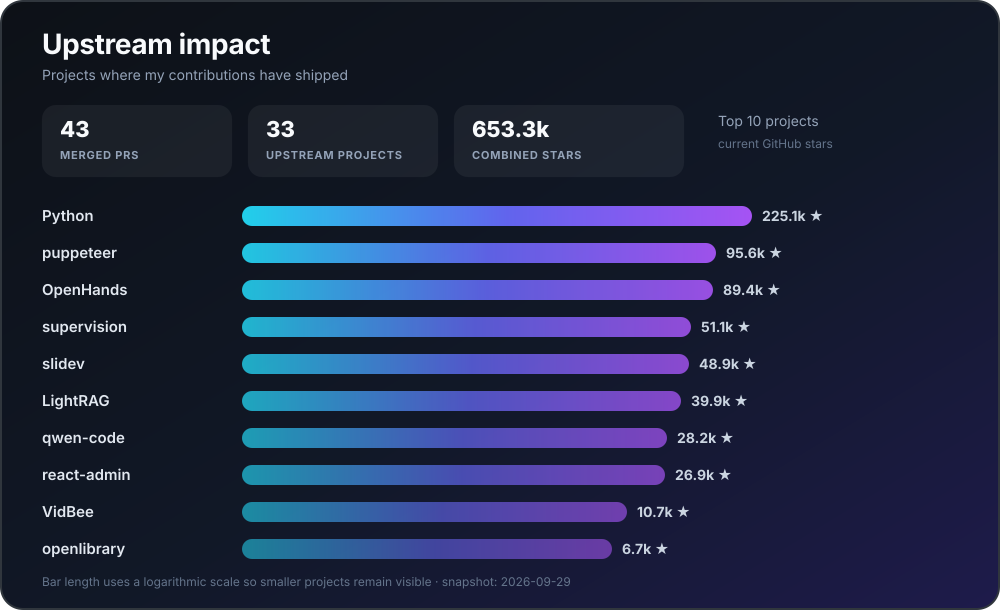
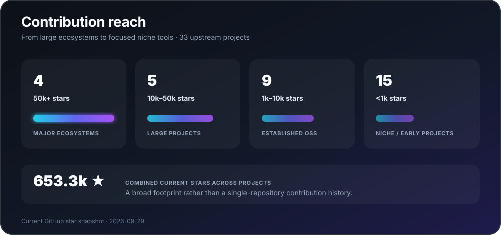

# Hey, I'm Jabrail 👋🏻

### AI systems · Developer tooling · Open-source engineering · Applied ML

**M.Sc. in Applied Mathematics and Computer Science · HSE University**

*Glad you stopped by.* I build practical software, experiment with AI-assisted development, run reproducible engineering research, and contribute production fixes and features upstream.

## 🧬 Things I build

<table>
<tr>
<td width="50%" valign="top">

### 🧠 [Xynapse](https://github.com/jabrailkhalil/xynapse)
A Code - OSS based IDE with an integrated AI assistant, agent workflows, Council/BVC planning, and auditable planning controls.

`AI agents` `Code - OSS` `TypeScript` `LLM tooling`

</td>
<td width="50%" valign="top">

### 🪟 [Click'n'Translate](https://github.com/jabrailkhalil/clickntranslate)
Open-source screen OCR and translation: games, images, video, apps, documents, offline engines, and global hotkeys. **3,400+ downloads.**

`Python` `OCR` `Desktop` `Translation`

</td>
</tr>
<tr>
<td width="50%" valign="top">

### 🕸️ [Mesh Grid Studio](https://github.com/jabrailkhalil/MeshGridStudio)
Interactive software and reproducible research for comparing structured numerical mesh-generation methods.

`Numerical methods` `Research` `Python` `LaTeX`

</td>
<td width="50%" valign="top">

### ⚗️ Engineering research
Evaluation, reliability, reproducibility, AI-agent planning, controlled experiments, benchmarking, and turning prototypes into auditable software artifacts.

`Evaluation` `Reproducibility` `AI systems` `DevTools`

</td>
</tr>
</table>

## 🔬 JAX case studies and reproducible demos

I document small JAX correctness investigations in [JAX reliability notes](https://github.com/jabrailkhalil/jax-reliability-notes): keyword forwarding in reusable autodiff and means over uneven replica groups. The material includes runnable CPU examples before and after the fixes, regression-test evidence, and a short technical-session outline.

The associated [#41156](https://github.com/jax-ml/jax/pull/41156) and [#41157](https://github.com/jax-ml/jax/pull/41157) contributions are open for upstream review as of 1 October 2026.

## 🛰️ Upstream open-source

**43 merged PRs across 33 upstream projects.** I contribute APIs, product fixes, packaging, CI, cross-platform behavior, regression tests, and documentation — not just drive-by edits.

| Project | Stars | Merged PRs |
| --- | ---: | --- |
| [TheAlgorithms/Python](https://github.com/TheAlgorithms/Python) | 225.1k ⭐ | [#15228](https://github.com/TheAlgorithms/Python/pull/15228) |
| [Puppeteer](https://github.com/puppeteer/puppeteer) | 95.6k ⭐ | [#15445](https://github.com/puppeteer/puppeteer/pull/15445) |
| [OpenHands](https://github.com/OpenHands/OpenHands) | 89.4k ⭐ | [#17152](https://github.com/OpenHands/OpenHands/pull/17152) |
| [Roboflow Supervision](https://github.com/roboflow/supervision) | 51.1k ⭐ | [#2557](https://github.com/roboflow/supervision/pull/2557) |
| [Slidev](https://github.com/slidevjs/slidev) | 48.9k ⭐ | [#2739](https://github.com/slidevjs/slidev/pull/2739) |
| [LightRAG](https://github.com/HKUDS/LightRAG) | 39.9k ⭐ | [#3905](https://github.com/HKUDS/LightRAG/pull/3905) |
| [Qwen Code](https://github.com/QwenLM/qwen-code) | 28.2k ⭐ | [#11722](https://github.com/QwenLM/qwen-code/pull/11722), [#12121](https://github.com/QwenLM/qwen-code/pull/12121), [#12126](https://github.com/QwenLM/qwen-code/pull/12126) |
| [react-admin](https://github.com/marmelab/react-admin) | 26.9k ⭐ | [#11367](https://github.com/marmelab/react-admin/pull/11367) |
| [VidBee](https://github.com/nexmoe/VidBee) | 10.7k ⭐ | [#469](https://github.com/nexmoe/VidBee/pull/469) |
| [Open Library](https://github.com/internetarchive/openlibrary) | 6.7k ⭐ | [#13598](https://github.com/internetarchive/openlibrary/pull/13598) |
| [Orval](https://github.com/orval-labs/orval) | 6.5k ⭐ | [#4074](https://github.com/orval-labs/orval/pull/4074) |
| [Agenta](https://github.com/Agenta-AI/agenta) | 4.8k ⭐ | [#6693](https://github.com/Agenta-AI/agenta/pull/6693) |
| [NullAway](https://github.com/uber/NullAway) | 4.1k ⭐ | [#1839](https://github.com/uber/NullAway/pull/1839) |
| [Apache Arrow Rust](https://github.com/apache/arrow-rs) | 3.6k ⭐ | [#11053](https://github.com/apache/arrow-rs/pull/11053) |
| [NumPyro](https://github.com/pyro-ppl/numpyro) | 2.8k ⭐ | [#2266](https://github.com/pyro-ppl/numpyro/pull/2266) |
| [MaterialX](https://github.com/AcademySoftwareFoundation/MaterialX) | 2.3k ⭐ | [#3065](https://github.com/AcademySoftwareFoundation/MaterialX/pull/3065) |
| [Kamaji](https://github.com/clastix/kamaji) | 2.0k ⭐ | [#1311](https://github.com/clastix/kamaji/pull/1311) |
| [ONEARMY Community Platform](https://github.com/ONEARMY/community-platform) | 1.4k ⭐ | [#4887](https://github.com/ONEARMY/community-platform/pull/4887) |
| [LibreDB Studio](https://github.com/libredb/libredb-studio) | 906 ⭐ | [#782](https://github.com/libredb/libredb-studio/pull/782), [#803](https://github.com/libredb/libredb-studio/pull/803) |
| [html-to-markdown](https://github.com/xberg-io/html-to-markdown) | 880 ⭐ | [#482](https://github.com/xberg-io/html-to-markdown/pull/482) |
| [Oppia Android](https://github.com/oppia/oppia-android) | 415 ⭐ | [#6444](https://github.com/oppia/oppia-android/pull/6444) |
| [Kroxylicious](https://github.com/kroxylicious/kroxylicious) | 324 ⭐ | [#4890](https://github.com/kroxylicious/kroxylicious/pull/4890) |
| [FDC3](https://github.com/finos/FDC3) | 271 ⭐ | [#2199](https://github.com/finos/FDC3/pull/2199) |
| [VSCode Monitor Pro](https://github.com/nexmoe/vscode-monitor-pro) | 221 ⭐ | [#482](https://github.com/nexmoe/vscode-monitor-pro/pull/482) |
| [codex-multi-launcher](https://github.com/JqyModi/codex-multi-launcher) | 143 ⭐ | [#19](https://github.com/JqyModi/codex-multi-launcher/pull/19) |
| [Orka](https://github.com/orka-agents/orka) | 28 ⭐ | [#528](https://github.com/orka-agents/orka/pull/528), [#531](https://github.com/orka-agents/orka/pull/531), [#532](https://github.com/orka-agents/orka/pull/532), [#534](https://github.com/orka-agents/orka/pull/534), [#535](https://github.com/orka-agents/orka/pull/535), [#536](https://github.com/orka-agents/orka/pull/536), [#537](https://github.com/orka-agents/orka/pull/537), [#538](https://github.com/orka-agents/orka/pull/538) |
| [Termlens](https://github.com/vyncint/termlens) | 27 ⭐ | [#321](https://github.com/vyncint/termlens/pull/321) |
| [sysknife](https://github.com/lacs-project/sysknife) | 14 ⭐ | [#422](https://github.com/lacs-project/sysknife/pull/422) |
| [soft-track](https://github.com/soft-track/soft-track) | 12 ⭐ | [#59](https://github.com/soft-track/soft-track/pull/59) |
| [DataSemVer](https://github.com/IzanVil/datasemver) | 2 ⭐ | [#7](https://github.com/IzanVil/datasemver/pull/7) |
| [sotto-action](https://github.com/getsotto/sotto-action) | 1 ⭐ | [#25](https://github.com/getsotto/sotto-action/pull/25) |
| [Protos](https://github.com/guillermomolina/protos) | 1 ⭐ | [#315](https://github.com/guillermomolina/protos/pull/315) |
| [TraceOS](https://github.com/junixlabs/traceos) | 0 ⭐ | [#23](https://github.com/junixlabs/traceos/pull/23) |

## 📈 Open-source impact

  
   
  
   
  

---

Build → measure → break → fix → ship → repeat.

